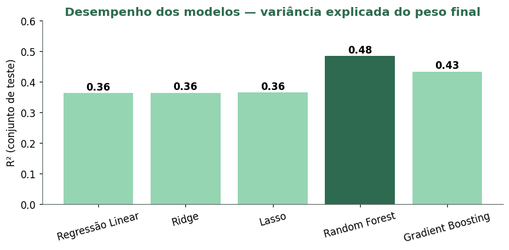
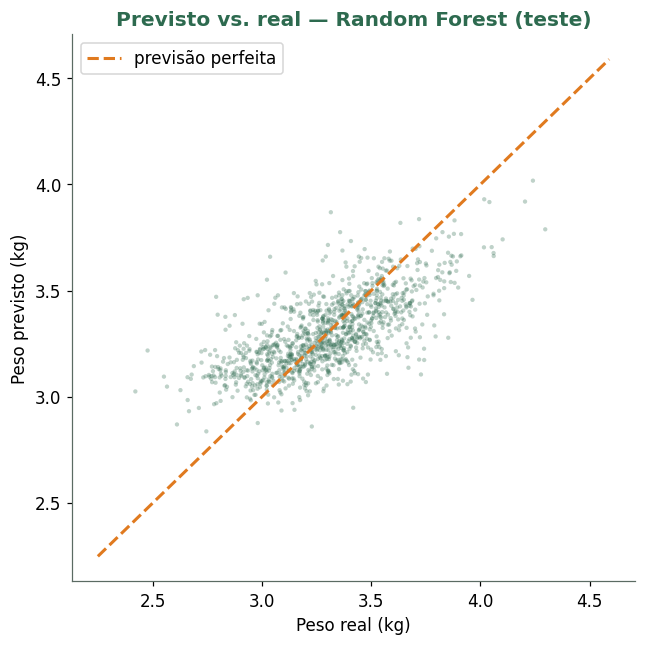
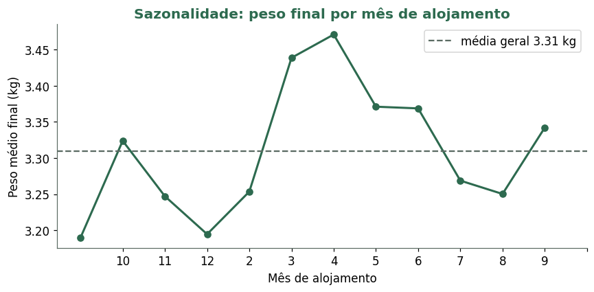

# 🐔 Predição do Peso Médio de Frangos de Corte

> Projeto de consultoria de dados para um **integrador avícola real** — modelagem preditiva do peso de abate a partir de fatores controláveis de produção.
> Atividade extensionista · Ciência de Dados e IA · PUC-SP


---

## 📌 Contexto

O peso médio do lote na hora do abate define a receita do produtor, mas varia de **2,2 a 4,6 kg** entre lotes sem causa óbvia. Este projeto, desenvolvido como caso real de consultoria, responde a três perguntas do cliente:

1. O peso final é **previsível** a partir do que o produtor controla **antes do abate**?
2. **Quais fatores** mais influenciam o peso?
3. **Onde agir** para ganhar gramas por ave?

A base tem **5.813 lotes × 40 variáveis**. A variável-resposta é a coluna **AN — `Peso Médio (kg)`**.

---

## 🎯 Destaque técnico — detecção de vazamento de dados

O ponto que separa um modelo honesto de um inútil. A própria definição do alvo é:

```
Peso Médio  =  Peso Abatido (kg)  ÷  Aves Abatidas
```

Essas colunas **não preveem** o peso — elas *são* o peso. Incluí-las daria R² ≈ 1 e um modelo que apenas repete uma divisão, sem gerar **nenhuma decisão de negócio**. O projeto **exclui toda variável medida no abate ou depois dele** (peso/aves abatidas, idade ao abate, totais e sobra de ração) e prevê o peso **ex-ante**, a partir de fatores de setup e de acompanhamento precoce.

---

## 🔬 Metodologia

| Etapa | O que foi feito |
|---|---|
| **Diagnóstico de qualidade** | Identificação de erros graves: pintinho de 599.391 kg, densidade de 1.844 aves/m², vazio sanitário negativo, pesagens com unidade trocada (kg × gramas) |
| **Limpeza** | Correção de unidades, remoção de valores fisicamente impossíveis (→ nulo → imputação por mediana) |
| **Engenharia de atributos** | Mês de alojamento (sazonalidade), *one-hot encoding*, agrupamento de categorias raras |
| **Dois cenários** | **A)** só setup (ex-ante) · **B)** setup + acompanhamento até os 21 dias |
| **Modelagem** | Regressão Linear, Ridge, Lasso, Random Forest, Gradient Boosting |
| **Validação** | Treino/teste 80/20 + validação cruzada 5-*fold* |

---

## 📊 Resultados

O **Random Forest** é o melhor modelo: explica cerca de **metade** da variação do peso, com erro médio de **~0,15 kg por ave** — cerca de **30% menos erro** que simplesmente chutar a média.

| Métrica | Random Forest | Baseline (média) |
|---|---|---|
| R² (teste) | **≈ 0,49** | 0 |
| RMSE | **≈ 0,19 kg** | 0,28 kg |
| MAE | **≈ 0,15 kg** | — |



O modelo captura a tendência central; a metade não explicada vem de fatores **não registrados** na base (clima diário, sanidade pontual, manejo fino) — um limite honesto a comunicar ao cliente.



---

## 💡 Principais achados

**O que move o peso:** tipo de instalação e sazonalidade dominam (~1/3 da importância); o programa nutricional pesa muito pouco (~1%).


**Quando alojar vale ~280 g por ave:** pico em abril, vale em dezembro/janeiro — estresse térmico de verão (e inverno) derruba o peso.



---

## ✅ Recomendações ao cliente

1. **Planejar o calendário de alojamento** — priorizar meses amenos e reforçar climatização no verão/inverno (~280 g/ave em jogo).
2. **Olhar para o tipo de instalação** — fator nº 1; mapear quais entregam mais peso e direcionar *retrofit*.
3. **Usar a pesagem dos 21 dias como alerta** — melhor indicador precoce; intervir nos lotes abaixo da curva antes do abate.
4. **Profissionalizar a coleta de dados** — validação de faixas na digitação reduz o ruído que hoje limita o modelo.

---

## ▶️ Como executar

```bash
git clone https://github.com/Alexander-Haug/predicao-peso-frangos.git
cd predicao-peso-frangos
pip install -r requirements.txt
jupyter notebook notebooks/analise_peso_frangos.ipynb
```

> O notebook já vem com as saídas e gráficos renderizados — dá para ler o projeto inteiro direto pelo GitHub, sem rodar nada. Para reexecutar, veja a nota sobre os dados em [`data/README.md`](data/README.md).

---

## 🛠️ Stack

`Python` · `pandas` · `numpy` · `scikit-learn` · `matplotlib` · `Jupyter`

---

## 🔒 Sobre os dados

A base é de um **cliente real** (integrador avícola), usada em atividade extensionista. Identificadores já vêm **pseudonimizados** (`P147`, `Tecnico_1`, `Regiao_1`), mas trata-se de dado de produção proprietário. Confirme com o orientador/cliente antes de publicar a base completa. Detalhes e esquema das variáveis em [`data/README.md`](data/README.md).

---

## 👥 Autoria

Projeto desenvolvido em equipe no curso de Ciência de Dados e IA — PUC-SP:

- **Alexander Haug** — [@Alexander-Haug](https://github.com/Alexander-Haug)
- Carlos Calil
- Carlos Braga
- Pedro Carvalho

> _Trabalho acadêmico colaborativo. Marque aqui a divisão de contribuições de cada integrante._

## 📄 Licença

Distribuído sob licença MIT — veja [`LICENSE`](LICENSE). A base de dados **não** está coberta pela licença e permanece propriedade do cliente.
