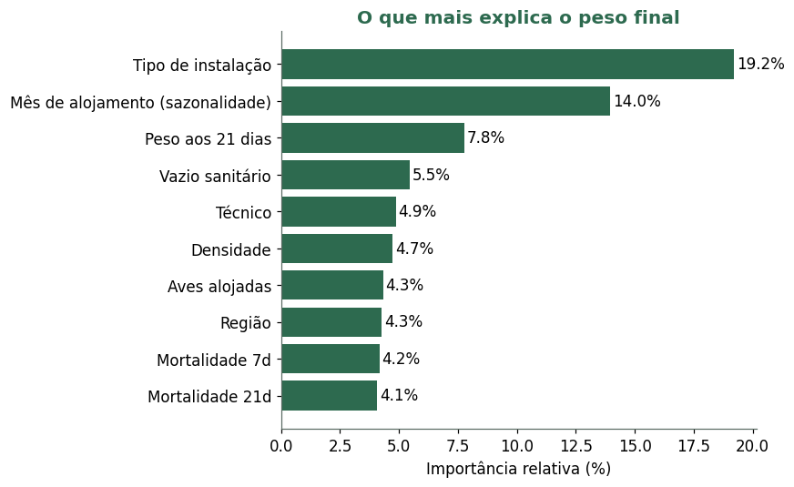

# 🐔 Predição do Peso de Frangos de Corte

Um integrador avícola percebeu que o peso médio dos lotes na hora do abate variava bastante de um lote para outro, de 2,2 a 4,6 kg, sem uma explicação clara. Como esse peso final é o que define a receita do produtor, entender de onde vem essa variação virou uma pergunta de negócio. Este projeto nasceu daí: usar os dados de produção do próprio cliente para descobrir se o peso pode ser previsto e, principalmente, o que fazer para melhorá-lo.

> Projeto de consultoria de dados desenvolvido como atividade extensionista no curso de Ciência de Dados e Inteligência Artificial da PUC-SP.

## O problema que o projeto resolve

O cliente tinha o histórico de 5.813 lotes guardado, mas esses dados não respondiam às perguntas que importavam no dia a dia:

- O peso final do lote pode ser previsto antes do abate, usando só o que o produtor já controla?
- Quais fatores realmente pesam no resultado, e quais eram só impressão?
- Onde vale a pena agir para ganhar alguns gramas por ave?

Sem essas respostas, decisões sobre instalação, nutrição e calendário de produção acabavam sendo tomadas no escuro.

## A solução

Construímos um modelo que estima o peso médio de abate de cada lote a partir de fatores conhecidos antes do abate, como genética, tipo de instalação, densidade, época do ano e as primeiras pesagens. Mais importante que o número em si, o projeto mostra de forma clara quais alavancas o cliente pode puxar para aumentar o peso.

Um cuidado guiou todo o trabalho: evitar o vazamento de dados (em inglês, *data leakage*). Esse problema acontece quando uma informação que só existe depois do resultado entra no modelo como se fosse uma previsão. No nosso caso, o peso médio é literalmente o peso total abatido dividido pelo número de aves abatidas. Usar essas colunas daria um modelo quase perfeito no papel e completamente inútil na prática, porque ele não ajudaria a decidir nada antes do abate. Por isso, toda variável medida no abate ou depois dele ficou de fora.

## Resultados

Entre os cinco modelos testados, o Random Forest teve o melhor desempenho. Ele é um conjunto de várias árvores de decisão que votam juntas para chegar a uma previsão. O modelo explica cerca de metade da variação do peso entre os lotes (R² próximo de 0,49), com um erro médio de aproximadamente 0,15 kg por ave. Na prática, isso é cerca de 30% menos erro do que simplesmente chutar a média.

O gráfico abaixo compara os cinco modelos pela variância explicada, ou seja, o quanto da variação do peso cada um consegue capturar.


No gráfico a seguir, cada ponto é um lote. Quanto mais perto da linha tracejada, mais próxima a previsão ficou do peso real.


Quando olhamos para o que mais influencia o peso, dois fatores se destacam: o tipo de instalação e a época do ano. Juntos, eles respondem por cerca de um terço da importância do modelo. Já o programa nutricional pesa muito pouco, perto de 1%.



O achado mais prático é a sazonalidade. Lotes alojados em abril chegam ao abate mais pesados, enquanto os de dezembro e janeiro ficam para trás. A diferença chega a cerca de 280 gramas por ave, provavelmente por causa do estresse térmico do verão.


A partir disso, as recomendações ao cliente ficaram diretas: planejar o calendário de alojamento priorizando meses mais amenos, investir nos tipos de instalação que entregam mais peso, e usar a pesagem dos 21 dias como alerta para agir nos lotes abaixo da curva enquanto ainda há tempo de corrigir.

## Como foi feito

O caminho dos dados brutos até o modelo passou por algumas decisões importantes, todas registradas no notebook.

- **Limpeza dos dados:** a base tinha erros graves de digitação, como um pintinho de 599 mil kg e densidades fisicamente impossíveis. Havia também pesagens misturando quilos e gramas. Esses valores foram corrigidos ou marcados como ausentes e depois preenchidos pela mediana.
- **Preparação das variáveis:** as colunas de texto (região, genética, tipo de instalação) viraram colunas numéricas com *one-hot encoding*, uma técnica que transforma cada categoria em uma coluna de 0 e 1. Categorias muito raras foram agrupadas para não virar ruído.
- **Dois cenários:** um modelo só com fatores de setup, conhecidos já no alojamento, e outro somando o acompanhamento das primeiras semanas de vida do lote.
- **Validação:** separação entre treino e teste (80/20) e validação cruzada de cinco fatias, para garantir que o resultado não fosse sorte de uma divisão específica dos dados.

## Ferramentas utilizadas

- `Python`
- `pandas` e `numpy` (tratamento dos dados)
- `scikit-learn` (modelos de machine learning)
- `matplotlib` (gráficos)
- `Jupyter Notebook`

## Como executar

```bash
git clone https://github.com/Alexander-Haug/predicao-peso-frangos.git
cd predicao-peso-frangos
pip install -r requirements.txt
jupyter notebook notebooks/analise_peso_frangos.ipynb
```

O notebook já vem com todos os gráficos e resultados salvos, então é possível ler o projeto inteiro direto pelo GitHub, sem precisar rodar nada.

## Sobre os dados

A base é de um cliente real e, por isso, não está incluída no repositório. Os identificadores já vêm anonimizados (o produtor aparece como `P147`, o técnico como `Tecnico_1`), mas ainda assim são dados de produção proprietários. Para reexecutar o notebook, basta colocar o arquivo da base na pasta `data/`. A descrição completa das variáveis está em `data/README.md`.

## Estrutura do repositório

| Pasta | O que contém |
|-------|--------------|
| `notebooks/` | O notebook com toda a análise, da base bruta aos resultados |
| `docs/` | Os gráficos gerados, usados neste README |
| `data/` | Descrição das variáveis e instruções sobre a base |

## Integrantes

Projeto desenvolvido em grupo para o curso de Ciência de Dados e Inteligência Artificial da PUC-SP:

- **Alexander Haug**
- **Carlos Calil**
- **Carlos Braga**
- **Pedro Carvalho**
